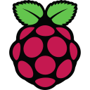
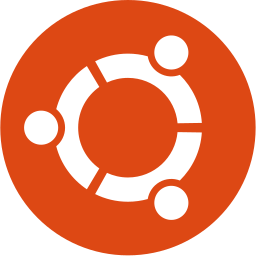
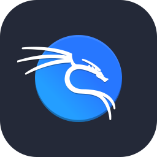
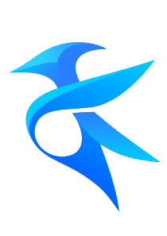
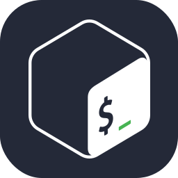
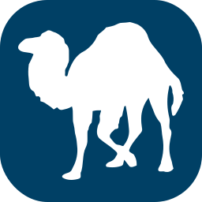
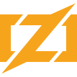

<!-- https://github.com/Zeronetsec/Zeronetsec -->

<h1 align="center">Zeronetsec</h1>

    <code>CLI Addict</code> • <code>CLI Tools Builder</code> • <code>Systems Explorer</code> • <code>Cybersecurity Enthusiast</code>

     
    

## Introduction
Honestly, I think I’m still a long way from calling myself a programmer.  
I’m just someone who loves colorful code and enjoys building functional things (at least, functional for me).  
Sometimes it's a cybersecurity toolkit, sometimes automation, and other times, just minor tools born purely out of curiosity.

## GitHub Stats

## Tech Stack
### Operating System:

    
    
    
    
    
    

### Toolkit:

    
    
    
    

### Languages:

    
    
    
    
    
    
    
    
    
    
    
    
    
    
    

## Languages Stats

<!-- Copyright (c) 2026 Zeronetsec -->